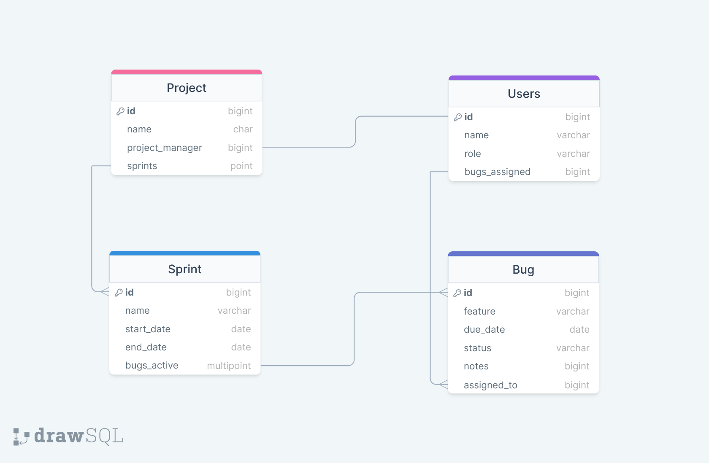

# Bug Tracker App
---
Bug Tracker App for Software Development Project Management

Created By: jessejamesva

## Description
This is going to be my personal project submission for Code Platoon's Uniform Cohort, Full-Stack Web Development boot camp. It is going to utilize Django and React, along with a few third-party APIs. 

The purpose of this web application will be to track software program issues during project sprints. Users will be able to submit issue tickets and program managers will assign them to developers in the group. Once tickets are assigned to a sprint, they will be visible on the sprint board and can be updated in an "assigned => in-progress => testing => completed" workflow. 

## Database Design
 

This isn't the exact database, but a rough draft I am using to get started. I'm sure this will change along the way. 

## What I Hope to Learn
This project is going to stretch what I have learned over the past 9 weeks regarding web development and programming in general. I will be using Django and the RestFramework to control the back-end, React for the front-end, PostgreSQL for storing data, various API calls, and lots of 'borrowed' CSS. I look forward to the challenges that lie ahead!
