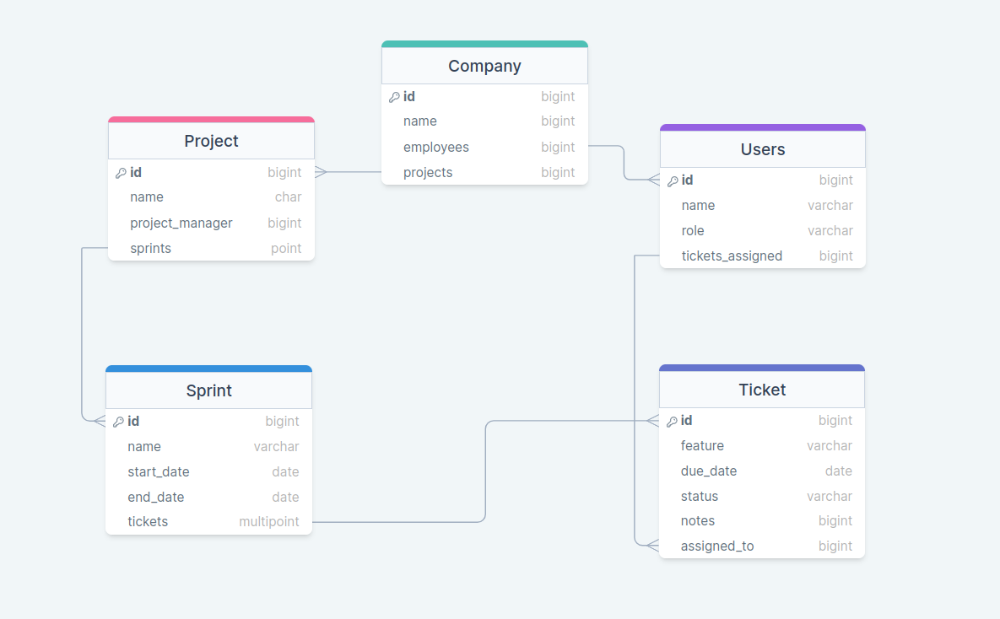
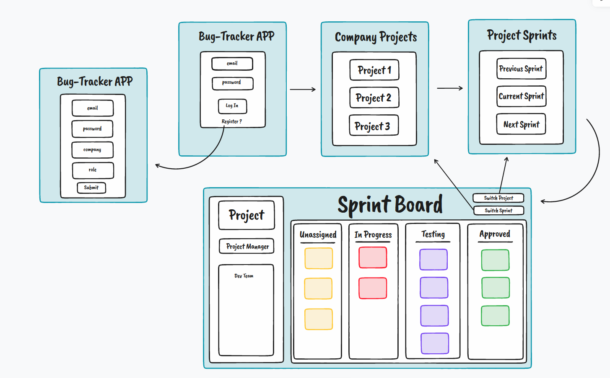

# Bug Tracker App
---
Bug Tracker App for Software Development Project Management

Created By: jessejamesva

## Description
This is going to be my personal project submission for Code Platoon's Uniform Cohort, Full-Stack Web Development boot camp. It is going to utilize Django and React, along with a few third-party APIs. 

The purpose of this web application will be to track software program issues during project sprints. Users will be able to submit issue tickets and program managers will assign them to developers in the group. Once tickets are assigned to a sprint, they will be visible on the sprint board and can be updated in an "assigned => in-progress => testing => completed" workflow. 

## Database Design
 

This isn't the exact database, but a rough draft I am using to get started. I'm sure this will change along the way. 

## User Interface

Sketch up on what I'm currently considering for the page designs. This is something else that will change over time. 

## What I Hope to Learn
This project is going to stretch what I have learned over the past 9 weeks regarding web development and programming in general. I will be using Django and the RestFramework to control the back-end, React for the front-end, PostgreSQL for storing data, various API calls, and lots of 'borrowed' CSS. 

## How I Plan to Get There

Taking things in stride! I'm gearing up to tackle this challenge that's definitely going to push my skills, but it's well within my reach.

I'm going to start off by sticking to my current plan and gradually building things up one step at a time. This way, I won't feel too overwhelmed or stuck in the nitty-gritty details. Beginning with setting up the back-end database seems like the way to go.

Of course, I also want to keep the momentum going to ensure I've got a functional project ready by the deadline. That's where my modular approach comes into play – I'll celebrate the small wins as I stack up the modules, without stressing too much about making each one absolutely perfect before moving on to the next.

I'm all in to face this challenge head-on, getting a working solution from start to finish. Once that's locked in, I'll circle back and enhance different aspects as my app takes shape. Step by step, I'll work my way towards a polished final product.
